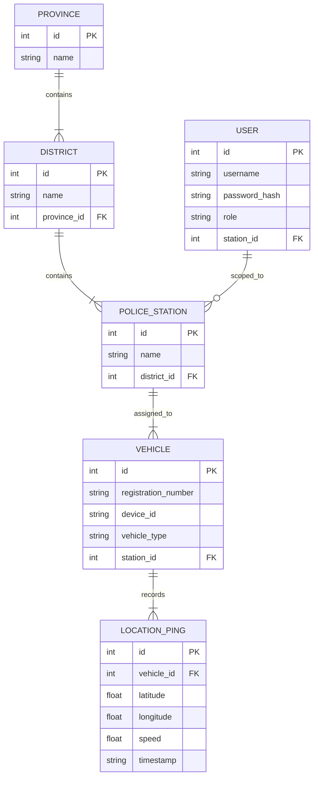
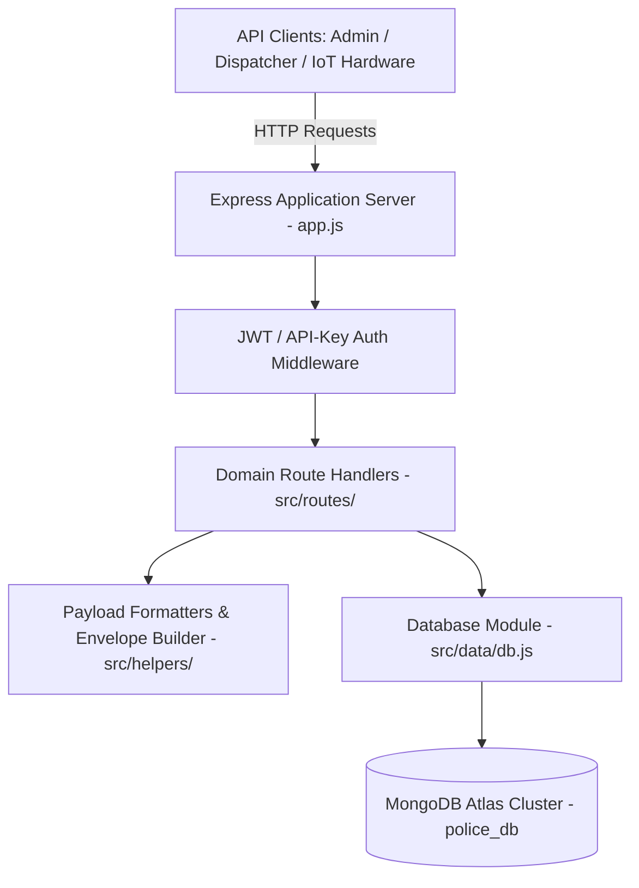
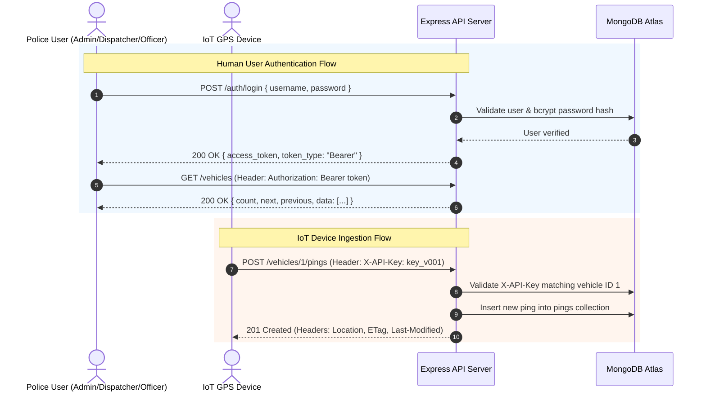
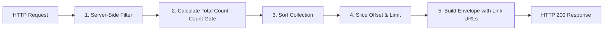

# Sri Lanka Police Vehicle Tracking API

This is a RESTful API built with Node.js, Express, and MongoDB, designed for tracking police vehicle positions in Sri Lanka. The project is developed as part of the coursework requirements for the NB6007CEM Web API Development module (Coventry University / NIBM).

*   **Student Registered Name:** W.P.N.S.M.D.SILVA
*   **NIBM Index Number:** COBSCCOMP25.1P-016
*   **Coventry Index Number:** 16602658
*   **Module:** NB6007CEM — Web API Development
*   **Programme:** BSc (Hons) Computer Science with Software Engineering (Coventry University / NIBM)
*   **Target Platform:** Render
*   **Production URL:** https://webapidev-test-8luf.onrender.com
*   **Postman Workspace Link:** [Sri Lanka Police API Workspace](https://www.postman.com/warped-firefly-225285/workspace/my-workspace)

---

## Table of Contents
1. [Project Overview](#1-project-overview)
2. [Domain Data Model](#2-domain-data-model)
3. [API Architecture & Directory Structure](#3-api-architecture--directory-structure)
4. [Dual Security & Authentication Architecture](#4-dual-security--authentication-architecture)
5. [WSO2 REST API Design Standards Compliance](#5-wso2-rest-api-design-standards-compliance)
6. [Query Execution Pipeline & Envelope Surface](#6-query-execution-pipeline--envelope-surface)
7. [Prerequisites & Installation](#7-prerequisites--installation)
8. [API Endpoints Reference](#8-api-endpoints-reference)
9. [Testing & Verification Guide](#9-testing--verification-guide)

---

## 1. Project Overview

This backend application tracks and manages geographical nodes (Provinces, Districts, Police Stations) and real-time GPS location telemetry from civilian and police vehicles across Sri Lanka. 

The API uses a persistent **MongoDB** database (via the official `mongodb` native driver) to store and query resources. On initial database setup or empty collection states, an automatic seeding mechanism populates the collections from `seed.json`.

---

## 2. Domain Data Model

The domain model represents the real-world administrative hierarchy of Sri Lanka Police and vehicle location tracking telemetry.



### Key Design Decisions:
*   **`device_id` as a Vehicle Attribute:** Each vehicle is fitted with exactly one IoT GPS hardware tracking device. `device_id` is an attribute of `VEHICLE` rather than a separate entity, avoiding unnecessary joins while reflecting hardware assignment.
*   **`LOCATION_PING` as an Append-Only Time-Series:** Pings are time-series data records (`ping_id`, `vehicle_id`, `timestamp`, `latitude`, `longitude`, `speed`). They are never overwritten or updated.

---

## 3. API Architecture & Directory Structure

The project follows a layered architecture supporting separation of concerns, performance, and clean code maintainability.



### Directory Structure

```
WebAPIDev_Test/
├── server.js                      ← Server entry point (binds port & starts DB connection)
├── src/
│   ├── app.js                     ← Express configuration and middleware mounting
│   ├── data/
│   │   └── db.js                  ← MongoDB connection management & auto-seeding logic
│   ├── middleware/
│   │   └── jwtAuth.js             ← JWT Bearer Token Auth & RBAC Guard middleware
│   ├── helpers/
│   │   ├── envelope.js            ← Collection envelope builder & ETag calculator
│   │   ├── formatters.js          ← Payload formatters and async query helpers
│   │   └── jwt.js                 ← JWT token signing and verification utilities
│   └── routes/
│       ├── auth.routes.js         ← Authentication endpoints (/auth/login, /auth/me)
│       ├── geography.routes.js    ← Provinces, Districts, and Stations endpoints
│       ├── vehicle.routes.js      ← Vehicle CRUD and position endpoints
│       └── ping.routes.js         ← Ping ingestion and single ping retrieval
├── package.json                   ← Project dependencies and startup scripts
├── seed.json                      ← Static seed dataset for initial database seeding
├── jwt_security_proposal.md       ← Security upgrade proposal documentation
├── render.yaml                    ← Render blueprint configuration
└── .gitignore
```

---

## 4. Dual Security & Authentication Architecture

The API implements a dual-security boundary based on client persona:



### A. JWT Authentication & Role-Based Access Control (Users & Administrators)
Protected HTTP routes require a JSON Web Token (JWT) provided in the HTTP `Authorization` header.

*   **Header Format:** `Authorization: Bearer <jwt_token>`
*   **Obtaining a Token:** Exchange credentials via `POST /auth/login`.
*   **Pre-Seeded Test Accounts:**
    *   **Administrator Account:** `admin_user` / `Admin@123` (Role: `ADMIN` — full access to read, create, update, and delete vehicle resources).
    *   **Dispatcher Account:** `dispatcher_colombo` / `Dispatch@123` (Role: `DISPATCHER` — full read access to vehicles, positions, and pings).
    *   **Patrol Officer Account:** `officer_patrol` / `Officer@123` (Role: `OFFICER` — read access to vehicle registry and positions).

### B. Device API Key Authentication (Vehicles/Ingestion Devices)
The GPS ingestion endpoint (`POST /vehicles/:vehicleId/pings`) is accessed by automated tracking hardware mounted on police vehicles. It bypasses JWT user authentication and is secured using a unique API Key.
*   **Header:** `X-API-Key`
*   **Format:** `key_v` + 3-digit zero-padded vehicle ID (e.g., `key_v001` for vehicle 1, `key_v012` for vehicle 12).
*   **Key Validation:** The key is compared deterministically against the specific vehicle ID in the request path.

---

## 5. WSO2 REST API Design Standards Compliance

The API strictly adheres to WSO2 REST API design specifications:

*   **Uniform Resource Identifiers (URIs):** All path segments use lowercase letters and hyphens (kebab-case). For example, `/last-position` is used instead of camelCase or snake_case.
*   **Resource Orientation:** URIs represent nouns (collections or individual resources) rather than actions or verbs. Operations are defined by standard HTTP methods (`GET`, `POST`, `PUT`, `DELETE`).
*   **Relationship Scoping:** Dependent collections are correctly scoped under parent resources (e.g., `/vehicles/:vehicleId/pings`). No bare `/pings` route exists.
*   **Collection Envelopes:** All collection resources (`/provinces`, `/districts`, `/stations`, `/vehicles`, `/vehicles/:vehicleId/pings`) are wrapped in a standard collection envelope: `{ "count": N, "next": "...", "previous": "...", "data": [...] }`. Member routes (`/vehicles/:id`, `/last-position`) remain bare JSON objects.
*   **Naming Conventions:** Response body fields are represented consistently in `snake_case` (e.g., `vehicle_id`, `reg_number`, `station_id`).
*   **Consistent Response Headers:** Successful resource creation (POST) returns standard `Location`, `ETag`, and `Last-Modified` headers.

---

## 6. Query Execution Pipeline & Envelope Surface

The API enforces a strict data processing order for querying collections (WSO2 §10.2, §10.3, §10.4):



### A. Collection Envelope Specification
Every collection route returns a uniform envelope:
```json
{
  "count": 214,
  "next": "https://webapidev-test-8luf.onrender.com/vehicles/1/pings?offset=20&limit=10&sort=timestamp,desc",
  "previous": "https://webapidev-test-8luf.onrender.com/vehicles/1/pings?offset=0&limit=10&sort=timestamp,desc",
  "data": [
    {
      "ping_id": 4158,
      "vehicle_id": 1,
      "timestamp": "2026-07-22T11:44:50.444Z",
      "lat": 6.9271,
      "lng": 79.8612,
      "speed": 55
    }
  ]
}
```
*   **`count` (The Count Gate):** Represents the total number of matching documents in MongoDB before pagination.
*   **`next` / `previous` Links:** Full URLs to follow-on pages, preserving all active query parameters (`district`, `from`, `to`, `sort`).

### B. Conditional GET & ETag Caching (`304 Not Modified`)
For `GET /vehicles/:vehicleId/last-position`:
*   The server computes an `ETag` MD5 hash of the position payload.
*   If the client sends an `If-None-Match: "<etag>"` header matching the current state, the server responds with **`304 Not Modified`** and a **0-byte empty body**, saving network bandwidth.

---

## 7. Prerequisites & Installation

### Prerequisites
*   Node.js (version 18 or higher recommended)
*   npm (Node Package Manager)
*   MongoDB instance (local or MongoDB Atlas connection URI)

### Installation
1. Clone the repository:
   ```bash
   git clone https://github.com/PruthuviDe/WebAPIDev_Test.git
   cd WebAPIDev_Test
   ```
2. Install the dependencies:
   ```bash
   npm install
   ```

### Environment Setup
Create a `.env` file or export `MONGODB_URI` in your shell:
```bash
export MONGODB_URI="mongodb+srv://<user>:<password>@cluster0.q8herfx.mongodb.net/police_db?retryWrites=true&w=majority"
export JWT_SECRET="police_jwt_secret_key_2024"
```

### Running Locally
To launch the server locally:
```bash
npm start
```
By default, the server listens on port `3000` (`http://localhost:3000`).

---

## 8. API Endpoints Reference

### Authentication Endpoints (Public)
| Method | Endpoint | Description | Auth Required |
| :--- | :--- | :--- | :--- |
| `POST` | `/auth/login` | Exchange credentials for JWT Bearer Token | Public |
| `GET` | `/auth/me` | Get profile of currently authenticated user | Bearer Token |

### Geographics (Read-Only)
| Method | Endpoint | Query Parameters | Response Format |
| :--- | :--- | :--- | :--- |
| `GET` | `/provinces` | `?offset=0&limit=10` | Envelope (`{ count, next, previous, data }`) |
| `GET` | `/provinces/:provinceId` | None | Bare Object (`{ province_id, name }`) |
| `GET` | `/districts` | `?offset=0&limit=10` | Envelope |
| `GET` | `/districts/:districtId` | None | Bare Object |
| `GET` | `/stations` | `?offset=0&limit=10` | Envelope |
| `GET` | `/stations/:stationId` | None | Bare Object |

### Vehicles & Location Telemetry
| Method | Endpoint | Query Parameters | Response Format |
| :--- | :--- | :--- | :--- |
| `GET` | `/vehicles` | `?district=`, `?province=`, `?station_id=`, `?offset=`, `?limit=` | Envelope |
| `GET` | `/vehicles/:vehicleId` | None | Bare Composite Object (includes nested `last_ping`) |
| `GET` | `/vehicles/:vehicleId/last-position` | None (Supports `If-None-Match` header) | Bare Object or `304 Not Modified` |
| `GET` | `/vehicles/:vehicleId/pings` | `?from=`, `?to=`, `?sort=timestamp,asc\|desc`, `?offset=`, `?limit=` | Envelope (Defaults to newest first) |
| `GET` | `/vehicles/:vehicleId/pings/:pingId` | None | Bare Object |

### Ingestion & Admin CRUD
| Method | Endpoint | Auth Required | Description |
| :--- | :--- | :--- | :--- |
| `POST` | `/vehicles/:vehicleId/pings` | `X-API-Key: key_vXXX` | Ingests new GPS ping (Returns `201 Created` + `Location`) |
| `POST` | `/vehicles` | `Bearer Token` (`ADMIN`) | Creates a new vehicle record |
| `PUT` | `/vehicles/:vehicleId` | `Bearer Token` (`ADMIN`) | Replaces full vehicle record |
| `DELETE` | `/vehicles/:vehicleId` | `Bearer Token` (`ADMIN`) | Deletes vehicle (pings remain intact) |

---

## 9. Testing & Verification Guide

### Postman Workspace Testing
A pre-configured Postman Collection is published in the Postman Workspace:
*   [Sri Lanka Police API Workspace Link](https://www.postman.com/warped-firefly-225285/workspace/my-workspace)

### cURL Verification Commands

**1. Login & Obtain JWT Token**
```bash
curl -X POST "https://webapidev-test-8luf.onrender.com/auth/login" \
     -H "Content-Type: application/json" \
     -d '{"username": "admin_user", "password": "Admin@123"}'
```

**2. Query Vehicles Collection with Envelope & Filtering**
```bash
curl -X GET "https://webapidev-test-8luf.onrender.com/vehicles?station_id=1&offset=0&limit=5" \
     -H "Authorization: Bearer <jwt_token>"
```

**3. Query Ping History with Sort & Date Filtering**
```bash
curl -X GET "https://webapidev-test-8luf.onrender.com/vehicles/1/pings?sort=timestamp,asc&offset=0&limit=5" \
     -H "Authorization: Bearer <jwt_token>"
```

**4. Test Conditional GET (304 Not Modified)**
```bash
curl -i -X GET "https://webapidev-test-8luf.onrender.com/vehicles/1/last-position" \
     -H "Authorization: Bearer <jwt_token>" \
     -H "If-None-Match: \"56b2ee8c0d88f58a9e1495c8ed75b03a\""
```

**5. Ingest Vehicle Ping (IoT X-API-Key Auth)**
```bash
curl -i -X POST "https://webapidev-test-8luf.onrender.com/vehicles/1/pings" \
     -H "X-API-Key: key_v001" \
     -H "Content-Type: application/json" \
     -d '{"latitude": 6.9271, "longitude": 79.8612, "speed": 45}'
```