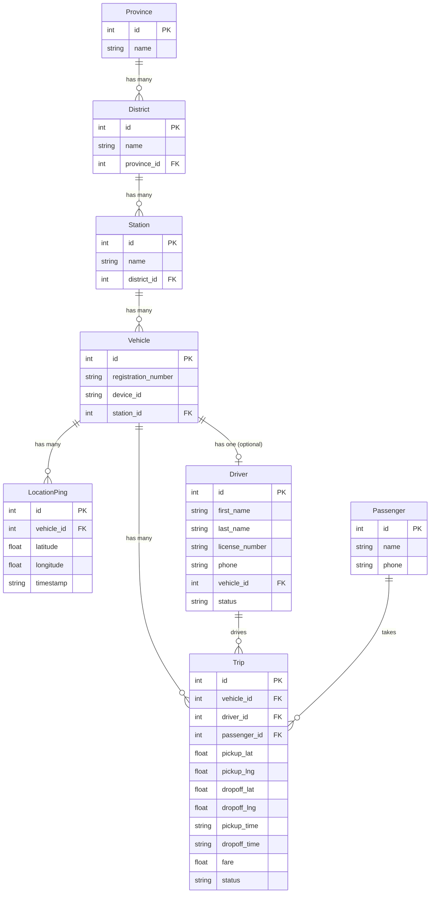

# Project Plan — Taxi Fleet Tracking REST API

> **Module:** NB6007CEM · Session: S2
> **Author:** Pruthuvi De Silva
> **Approach:** Extend the existing WebAPIDev_Test project
> **Date:** 2026-07-05

---

## 1. Business Case

### 1.1 Problem Statement

A Sri Lankan taxi company operates a fleet of vehicles across all 9 provinces. The company needs a REST API to:

1. **Track the real-time position** of every taxi in the fleet — dispatchers need to know where each vehicle is right now.
2. **Manage trips/rides** — record each passenger ride from pickup to dropoff, including fare calculation, so the company can analyse revenue, utilisation, and driver performance.
3. **Manage drivers** — know which driver is assigned to which vehicle, their license details, contact information, and current duty status.
4. **Track passengers** — maintain a lightweight customer record for ride history and repeat bookings.

### 1.2 Domain Context

The taxi company is structured geographically:

```
Province → District → Depot
                        ↓
                     Vehicle → GPS Pings
                        ↓
                     Driver (assigned to vehicle)
                        ↓
                     Trips (pickup → dropoff)
                        ↓
                     Passenger (who booked the trip)
```

> **Assumption:** "Station" in the existing seed data represents a police station. For the taxi business case, this maps directly to a **Depot** (a physical location where taxis are based). The seed.json `stations` array will be conceptually treated as depots. The API route remains `/stations` (unchanged from the existing codebase) to avoid breaking changes, but in the business context and documentation, these are "Depots" or "Taxi Stands".

---

## 2. Data Model

### 2.1 Existing Entities (from seed.json — read-only)

These entities already exist in `seed.json` and are served by the current API. Their shapes were finalised in Layer 1.

#### Province
```json
{
  "id": 1,
  "name": "Western"
}
```
**API shape:** `{ province_id, name }`

#### District
```json
{
  "id": 1,
  "name": "Colombo",
  "province_id": 1
}
```
**API shape:** `{ district_id, name, province_id }`

#### Station (Depot)
```json
{
  "id": 1,
  "name": "Colombo Fort Police Station",
  "district_id": 1
}
```
**API shape:** `{ station_id, name, district_id }`

> **Assumption:** In the taxi business context, station names would be like "Colombo Fort Taxi Depot". The seed data uses police station names from the original dataset. For the purposes of this coursework, we accept the existing station names and note in the report that the business case treats them as taxi depots.

#### Vehicle
```json
{
  "id": 1,
  "registration_number": "BE-8598",
  "device_id": "DEV-0001",
  "station_id": 2
}
```
**API shape:** `{ vehicle_id, reg_number, device_id, station_id }`

**Composite shape** (GET /vehicles/:vehicleId):
```json
{
  "vehicle_id": 1,
  "reg_number": "BE-8598",
  "device_id": "DEV-0001",
  "station_id": 2,
  "last_ping": {
    "ping_id": 24,
    "vehicle_id": 1,
    "timestamp": "2026-06-20T19:44:23.000Z",
    "lat": 6.947407,
    "lng": 79.811024,
    "speed": null
  }
}
```

#### LocationPing
```json
{
  "id": 1,
  "vehicle_id": 1,
  "latitude": 6.953152,
  "longitude": 79.816119,
  "timestamp": "2026-06-14T19:29:12.000Z"
}
```
**API shape:** `{ ping_id, vehicle_id, timestamp, lat, lng, speed }`

> **Assumption:** `speed` is not present in seed.json. Always returned as `null`. A real GPS device would provide this field.

---

### 2.2 New Entities (to be added to seed.json)

These are the new entities required by the taxi business case. They will be added to `seed.json` and new routes will be created.

#### Driver

A driver is a person employed by the taxi company, assigned to a specific vehicle at a depot.

```json
{
  "id": 1,
  "first_name": "Kasun",
  "last_name": "Perera",
  "license_number": "B-1234567",
  "phone": "+94771234567",
  "vehicle_id": 1,
  "status": "on-duty"
}
```

| Field | Type | Description |
|-------|------|-------------|
| `id` | integer | Unique identifier |
| `first_name` | string | Driver's first name |
| `last_name` | string | Driver's last name |
| `license_number` | string | Sri Lankan driving license number |
| `phone` | string | Contact number (E.164 format) |
| `vehicle_id` | integer | FK → Vehicle. The vehicle this driver is currently assigned to |
| `status` | string | One of: `"on-duty"`, `"off-duty"`, `"on-trip"` |

**API shape:** `{ driver_id, first_name, last_name, license_number, phone, vehicle_id, status }`

> **Assumption:** One driver per vehicle at a time. If a vehicle has no driver assigned, no driver record will have that `vehicle_id`. A driver with `status: "on-trip"` is currently driving a passenger. We do not model driver shift history — only the current state.

> **Assumption:** We generate ~50 drivers for seed data (not all 200 vehicles will have drivers assigned, simulating some vehicles being idle/unassigned). This is realistic — a taxi company rarely has a 1:1 driver-to-vehicle ratio across all shifts.

---

#### Passenger

A passenger is a customer who has booked at least one trip.

```json
{
  "id": 1,
  "name": "Amali Fernando",
  "phone": "+94771112233"
}
```

| Field | Type | Description |
|-------|------|-------------|
| `id` | integer | Unique identifier |
| `name` | string | Full name |
| `phone` | string | Contact number (E.164 format) |

**API shape:** `{ passenger_id, name, phone }`

> **Assumption:** Passengers are kept lightweight — no email, no address, no payment info. The API models a dispatch/tracking system, not a payment gateway. A real system would have more fields, but for this coursework the focus is on the vehicle tracking domain.

> **Assumption:** We generate ~100 passengers for seed data.

---

#### Trip

A trip represents a single ride from pickup to dropoff by one vehicle carrying one passenger.

```json
{
  "id": 1,
  "vehicle_id": 3,
  "driver_id": 2,
  "passenger_id": 15,
  "pickup_lat": 6.9271,
  "pickup_lng": 79.8612,
  "dropoff_lat": 6.9147,
  "dropoff_lng": 79.8725,
  "pickup_time": "2026-06-15T08:30:00.000Z",
  "dropoff_time": "2026-06-15T09:05:00.000Z",
  "fare": 850.00,
  "status": "completed"
}
```

| Field | Type | Description |
|-------|------|-------------|
| `id` | integer | Unique identifier |
| `vehicle_id` | integer | FK → Vehicle |
| `driver_id` | integer | FK → Driver |
| `passenger_id` | integer | FK → Passenger |
| `pickup_lat` | number | Pickup latitude |
| `pickup_lng` | number | Pickup longitude |
| `dropoff_lat` | number | Dropoff latitude (null if in-progress) |
| `dropoff_lng` | number | Dropoff longitude (null if in-progress) |
| `pickup_time` | string | ISO 8601 timestamp — when the ride started |
| `dropoff_time` | string | ISO 8601 timestamp — when the ride ended (null if in-progress) |
| `fare` | number | Fare in LKR (null if in-progress, calculated at dropoff) |
| `status` | string | One of: `"requested"`, `"in-progress"`, `"completed"`, `"cancelled"` |

**API shape:** `{ trip_id, vehicle_id, driver_id, passenger_id, pickup_lat, pickup_lng, dropoff_lat, dropoff_lng, pickup_time, dropoff_time, fare, status }`

> **Assumption:** Fare is a flat number in Sri Lankan Rupees (LKR). No complex fare calculation (surge pricing, distance-based tiers, etc.) — just a pre-calculated number stored in the seed data. A real system would calculate fare based on distance and time; for this coursework, the fare is static seed data.

> **Assumption:** We generate ~300 trips — a mix of `"completed"` (most), `"in-progress"` (a few), and `"cancelled"` (a few). This gives realistic data for querying.

> **Assumption:** A trip belongs to exactly one vehicle, one driver, and one passenger. We do not model ride-sharing (multiple passengers per trip).

---

### 2.3 Entity Relationship Diagram



**Hierarchy traversal:**
- Province → Districts: `districts.filter(d => d.province_id === id)`
- District → Stations: `stations.filter(s => s.district_id === id)`
- Station → Vehicles: `vehicles.filter(v => v.station_id === id)`
- Vehicle → Pings: `pings.filter(p => p.vehicle_id === id)`
- Vehicle → Trips: `trips.filter(t => t.vehicle_id === id)`
- Vehicle → Driver: `drivers.find(d => d.vehicle_id === id)`
- Driver → Trips: `trips.filter(t => t.driver_id === id)`
- Passenger → Trips: `trips.filter(t => t.passenger_id === id)`

---

## 3. Route Design

All routes follow WSO2 REST API Design Guidelines §5.1:
- Lowercase, hyphen-separated path segments
- Plural nouns for collections, singular params for members
- Nouns not verbs — HTTP method carries the verb
- `res.json()` for all responses, `Content-Type: application/json`
- No envelope wrappers — flat `[...]` or `{...}`
- All field names in `snake_case`

### 3.1 Existing Routes (unchanged from Layers 1–3)

| Method | Path | Response shape | Type |
|--------|------|---------------|------|
| GET | `/` | `{ status, session }` | Health check |
| GET | `/provinces` | `[{ province_id, name }]` | Collection |
| GET | `/provinces/:provinceId` | `{ province_id, name }` | Atomic |
| GET | `/districts` | `[{ district_id, name, province_id }]` | Collection |
| GET | `/districts/:districtId` | `{ district_id, name, province_id }` | Atomic |
| GET | `/stations` | `[{ station_id, name, district_id }]` | Collection |
| GET | `/stations/:stationId` | `{ station_id, name, district_id }` | Atomic |
| GET | `/vehicles` | `[{ vehicle_id, reg_number, device_id, station_id }]` | Collection |
| GET | `/vehicles/:vehicleId` | `{ vehicle_id, ..., last_ping }` | Composite (§4.3) |
| GET | `/vehicles/:vehicleId/pings` | `[{ ping_id, vehicle_id, timestamp, lat, lng, speed }]` | Sub-collection |
| GET | `/vehicles/:vehicleId/last-position` | `{ vehicle_id, timestamp, lat, lng, speed }` | Processing function |

### 3.2 New Routes — Drivers

| Method | Path | Response shape | Type | Notes |
|--------|------|---------------|------|-------|
| GET | `/drivers` | `[{ driver_id, first_name, last_name, license_number, phone, vehicle_id, status }]` | Collection | All drivers |
| GET | `/drivers/:driverId` | `{ driver_id, first_name, last_name, license_number, phone, vehicle_id, status }` | Atomic | 404 if not found |
| POST | `/drivers` | `{ driver_id, ... }` | Create | Returns 201 + created driver |
| PUT | `/drivers/:driverId` | `{ driver_id, ... }` | Full update | Replaces all fields, 404 if not found |
| DELETE | `/drivers/:driverId` | `(empty, 204)` | Delete | 404 if not found |

**Sub-resource:**

| Method | Path | Response shape | Notes |
|--------|------|---------------|-------|
| GET | `/vehicles/:vehicleId/driver` | `{ driver_id, ... }` | Singular — one driver per vehicle. 404 if no driver assigned |

> **Design decision — `/vehicles/:vehicleId/driver` (singular, not plural):** A vehicle has exactly one driver at a time. The sub-resource uses the singular noun `driver` rather than `drivers` because it represents a single assigned resource, not a collection. This follows WSO2 §5.1 naming guidance: plural for collections, singular for individual resources.

### 3.3 New Routes — Passengers

| Method | Path | Response shape | Type | Notes |
|--------|------|---------------|------|-------|
| GET | `/passengers` | `[{ passenger_id, name, phone }]` | Collection | All passengers |
| GET | `/passengers/:passengerId` | `{ passenger_id, name, phone }` | Atomic | 404 if not found |
| POST | `/passengers` | `{ passenger_id, ... }` | Create | Returns 201 |
| PUT | `/passengers/:passengerId` | `{ passenger_id, ... }` | Full update | 404 if not found |
| DELETE | `/passengers/:passengerId` | `(empty, 204)` | Delete | 404 if not found |

**Sub-resource:**

| Method | Path | Response shape | Notes |
|--------|------|---------------|-------|
| GET | `/passengers/:passengerId/trips` | `[{ trip_id, ... }]` | All trips for this passenger |

### 3.4 New Routes — Trips

| Method | Path | Response shape | Type | Notes |
|--------|------|---------------|------|-------|
| GET | `/trips` | `[{ trip_id, vehicle_id, driver_id, passenger_id, pickup_lat, pickup_lng, dropoff_lat, dropoff_lng, pickup_time, dropoff_time, fare, status }]` | Collection | All trips |
| GET | `/trips/:tripId` | `{ trip_id, ... }` | Atomic | 404 if not found |
| POST | `/trips` | `{ trip_id, ... }` | Create | Returns 201. New trip starts with `status: "requested"` |
| PUT | `/trips/:tripId` | `{ trip_id, ... }` | Full update | Update trip status, fare, dropoff, etc. |
| DELETE | `/trips/:tripId` | `(empty, 204)` | Delete | 404 if not found |

**Sub-resources:**

| Method | Path | Response shape | Notes |
|--------|------|---------------|-------|
| GET | `/vehicles/:vehicleId/trips` | `[{ trip_id, ... }]` | All trips for a specific vehicle |
| GET | `/drivers/:driverId/trips` | `[{ trip_id, ... }]` | All trips for a specific driver |

### 3.5 New Route — Vehicle Composite Enhancement

The existing `GET /vehicles/:vehicleId` composite will be enhanced to include the assigned driver:

```json
{
  "vehicle_id": 1,
  "reg_number": "BE-8598",
  "device_id": "DEV-0001",
  "station_id": 2,
  "last_ping": { ... } | null,
  "driver": {
    "driver_id": 5,
    "first_name": "Kasun",
    "last_name": "Perera",
    "status": "on-duty"
  } | null
}
```

> **Design decision — driver in composite:** The vehicle composite (§4.3) already nests `last_ping` to avoid a second API call. Adding `driver` follows the same pattern: a dispatcher viewing a vehicle's details needs to see who is driving it without making a separate request. The `driver` field in the composite is a **subset** of the full driver shape (omits `license_number` and `phone` — those are available from `GET /drivers/:driverId`).

---

## 4. Representations (Response Shapes)

### 4.1 Shape Summary Table

| Entity | API Shape | Notes |
|--------|-----------|-------|
| Province | `{ province_id, name }` | Unchanged |
| District | `{ district_id, name, province_id }` | Unchanged |
| Station | `{ station_id, name, district_id }` | Unchanged |
| Vehicle (collection) | `{ vehicle_id, reg_number, device_id, station_id }` | Unchanged |
| Vehicle (member/composite) | `{ vehicle_id, reg_number, device_id, station_id, last_ping, driver }` | Enhanced with `driver` |
| LocationPing | `{ ping_id, vehicle_id, timestamp, lat, lng, speed }` | Unchanged |
| Last Position | `{ vehicle_id, timestamp, lat, lng, speed }` | Unchanged |
| Driver | `{ driver_id, first_name, last_name, license_number, phone, vehicle_id, status }` | **New** |
| Driver (embedded in vehicle) | `{ driver_id, first_name, last_name, status }` | Subset |
| Passenger | `{ passenger_id, name, phone }` | **New** |
| Trip | `{ trip_id, vehicle_id, driver_id, passenger_id, pickup_lat, pickup_lng, dropoff_lat, dropoff_lng, pickup_time, dropoff_time, fare, status }` | **New** |

### 4.2 Seed Field → API Field Mappings

All entities follow the same pattern: `id` → `{entity}_id`, and any multi-word fields use `snake_case`.

| Seed field | API field | Entity |
|------------|-----------|--------|
| `id` | `driver_id` | Driver |
| `first_name` | `first_name` | Driver |
| `last_name` | `last_name` | Driver |
| `license_number` | `license_number` | Driver |
| `phone` | `phone` | Driver |
| `vehicle_id` | `vehicle_id` | Driver (FK) |
| `status` | `status` | Driver |
| `id` | `passenger_id` | Passenger |
| `name` | `name` | Passenger |
| `phone` | `phone` | Passenger |
| `id` | `trip_id` | Trip |
| `vehicle_id` | `vehicle_id` | Trip (FK) |
| `driver_id` | `driver_id` | Trip (FK) |
| `passenger_id` | `passenger_id` | Trip (FK) |
| `pickup_lat` | `pickup_lat` | Trip |
| `pickup_lng` | `pickup_lng` | Trip |
| `dropoff_lat` | `dropoff_lat` | Trip |
| `dropoff_lng` | `dropoff_lng` | Trip |
| `pickup_time` | `pickup_time` | Trip |
| `dropoff_time` | `dropoff_time` | Trip |
| `fare` | `fare` | Trip |
| `status` | `status` | Trip |

---

## 5. CRUD Operations Design

### 5.1 POST (Create)

For `POST /drivers`, `POST /passengers`, and `POST /trips`:

- Accept JSON body via `express.json()` middleware (will need to add this)
- Auto-assign the next available `id` (max existing id + 1)
- Validate required fields — return `400` with `{ error: "Missing required field: ..." }`
- Return `201 Created` with the full created resource in the response body
- The created resource is added to the in-memory `db` array

> **Assumption:** Since we use seed.json loaded into memory (no database), POST/PUT/DELETE operations only modify the in-memory array. Data resets on server restart. This is acceptable for coursework purposes and is explicitly noted.

### 5.2 PUT (Full Update)

For `PUT /drivers/:driverId`, `PUT /passengers/:passengerId`, `PUT /trips/:tripId`:

- Accept JSON body
- Find the existing record by `id` — return `404` if not found
- Replace all mutable fields with values from the request body
- The `id` field is immutable — cannot be changed via PUT
- Return `200 OK` with the updated resource

### 5.3 DELETE

For `DELETE /drivers/:driverId`, `DELETE /passengers/:passengerId`, `DELETE /trips/:tripId`:

- Find the existing record by `id` — return `404` if not found
- Remove from the in-memory array
- Return `204 No Content` (empty body)

> **Assumption:** DELETE does not cascade. Deleting a driver does not delete their trips. Deleting a passenger does not delete their trips. This is a deliberate simplification — in a real system you would handle referential integrity.

### 5.4 Required Middleware

```js
app.use(express.json());
```

> This must be added before all route definitions to parse JSON request bodies for POST and PUT. This is the **only middleware** being added.

---

## 6. Seed Data Generation Plan

New data arrays to add to `seed.json`:

| Array | Count | Generation Notes |
|-------|-------|-----------------|
| `drivers` | 50 | Random Sri Lankan names, assigned to vehicles 1–50, mix of statuses |
| `passengers` | 100 | Random Sri Lankan names, phone numbers |
| `trips` | 300 | Random combinations of vehicles (that have drivers), passengers, realistic Colombo-area coordinates, timestamps within the last 2 weeks, fares between LKR 200–5000 |

> **Assumption:** Driver names and passenger names will use common Sri Lankan names (Sinhalese, Tamil, and Muslim names reflecting the country's demographics). Phone numbers will use the `+9477xxxxxxx` format.

> **Assumption:** Trip coordinates will be within the greater Colombo area (lat 6.85–7.00, lng 79.82–79.90) for realism. Some trips will span to Kandy, Galle, etc. for variety.

---

## 7. New Shape Helpers

```js
const fmtDriver    = d => ({
  driver_id: d.id,
  first_name: d.first_name,
  last_name: d.last_name,
  license_number: d.license_number,
  phone: d.phone,
  vehicle_id: d.vehicle_id,
  status: d.status
});

const fmtDriverEmbed = d => ({
  driver_id: d.id,
  first_name: d.first_name,
  last_name: d.last_name,
  status: d.status
});

const fmtPassenger = p => ({
  passenger_id: p.id,
  name: p.name,
  phone: p.phone
});

const fmtTrip      = t => ({
  trip_id: t.id,
  vehicle_id: t.vehicle_id,
  driver_id: t.driver_id,
  passenger_id: t.passenger_id,
  pickup_lat: t.pickup_lat,
  pickup_lng: t.pickup_lng,
  dropoff_lat: t.dropoff_lat,
  dropoff_lng: t.dropoff_lng,
  pickup_time: t.pickup_time,
  dropoff_time: t.dropoff_time,
  fare: t.fare,
  status: t.status
});
```

---

## 8. Implementation Phases

### Phase 1: Seed Data Generation
- Write a Node.js script to generate the `drivers`, `passengers`, and `trips` arrays
- Merge them into the existing `seed.json`
- Verify data integrity (all FKs point to existing records)

### Phase 2: Read Routes (GET)
- Add shape helpers for Driver, Passenger, Trip
- Add all GET collection, atomic, and sub-resource routes
- Enhance vehicle composite to include `driver` field
- Test all routes locally

### Phase 3: Write Routes (POST, PUT, DELETE)
- Add `express.json()` middleware
- Implement POST with auto-ID and validation
- Implement PUT with field replacement
- Implement DELETE with 204 response
- Test all CRUD operations locally

### Phase 4: Deploy & Verify
- Commit and push to `prod`
- Verify all routes on the live Render URL
- Update PROJECT_MEMORY.md with new routes and commit history

---

## 9. Complete Route Table (Post-Implementation)

| # | Method | Path | Response | Type |
|---|--------|------|----------|------|
| 1 | GET | `/` | `{ status, session }` | Health |
| 2 | GET | `/provinces` | `[{ province_id, name }]` | Collection |
| 3 | GET | `/provinces/:provinceId` | `{ province_id, name }` | Atomic |
| 4 | GET | `/districts` | `[{ district_id, name, province_id }]` | Collection |
| 5 | GET | `/districts/:districtId` | `{ district_id, name, province_id }` | Atomic |
| 6 | GET | `/stations` | `[{ station_id, name, district_id }]` | Collection |
| 7 | GET | `/stations/:stationId` | `{ station_id, name, district_id }` | Atomic |
| 8 | GET | `/vehicles` | `[{ vehicle_id, reg_number, device_id, station_id }]` | Collection |
| 9 | GET | `/vehicles/:vehicleId` | `{ ..., last_ping, driver }` | Composite |
| 10 | GET | `/vehicles/:vehicleId/pings` | `[{ ping_id, ... }]` | Sub-collection |
| 11 | GET | `/vehicles/:vehicleId/last-position` | `{ vehicle_id, timestamp, lat, lng, speed }` | Processing |
| 12 | GET | `/vehicles/:vehicleId/driver` | `{ driver_id, ... }` | Sub-resource |
| 13 | GET | `/vehicles/:vehicleId/trips` | `[{ trip_id, ... }]` | Sub-collection |
| 14 | GET | `/drivers` | `[{ driver_id, ... }]` | Collection |
| 15 | GET | `/drivers/:driverId` | `{ driver_id, ... }` | Atomic |
| 16 | POST | `/drivers` | `{ driver_id, ... }` | Create (201) |
| 17 | PUT | `/drivers/:driverId` | `{ driver_id, ... }` | Update (200) |
| 18 | DELETE | `/drivers/:driverId` | _(empty, 204)_ | Delete |
| 19 | GET | `/drivers/:driverId/trips` | `[{ trip_id, ... }]` | Sub-collection |
| 20 | GET | `/passengers` | `[{ passenger_id, ... }]` | Collection |
| 21 | GET | `/passengers/:passengerId` | `{ passenger_id, ... }` | Atomic |
| 22 | POST | `/passengers` | `{ passenger_id, ... }` | Create (201) |
| 23 | PUT | `/passengers/:passengerId` | `{ passenger_id, ... }` | Update (200) |
| 24 | DELETE | `/passengers/:passengerId` | _(empty, 204)_ | Delete |
| 25 | GET | `/passengers/:passengerId/trips` | `[{ trip_id, ... }]` | Sub-collection |
| 26 | GET | `/trips` | `[{ trip_id, ... }]` | Collection |
| 27 | GET | `/trips/:tripId` | `{ trip_id, ... }` | Atomic |
| 28 | POST | `/trips` | `{ trip_id, ... }` | Create (201) |
| 29 | PUT | `/trips/:tripId` | `{ trip_id, ... }` | Update (200) |
| 30 | DELETE | `/trips/:tripId` | _(empty, 204)_ | Delete |

**Total: 30 routes** (11 existing + 19 new)

---

## 10. Assumptions Summary

| # | Assumption | Rationale |
|---|-----------|-----------|
| 1 | "Station" = "Depot" in the taxi context | Reuses existing seed data structure without breaking changes |
| 2 | One driver per vehicle at a time | Simplifies assignment model; realistic for shift-based taxis |
| 3 | ~50 drivers, ~100 passengers, ~300 trips | Provides enough data for meaningful queries without bloating seed.json |
| 4 | Fare is pre-calculated in LKR | No fare algorithm needed — coursework focus is on API design, not business logic |
| 5 | No ride-sharing | One passenger per trip keeps the model clean |
| 6 | No cascading deletes | Deliberate simplification — noted for the report |
| 7 | CRUD modifies in-memory only | Data resets on restart — acceptable for coursework |
| 8 | `speed` remains `null` | Seed GPS pings have no speed data |
| 9 | Coordinates centered on Colombo area | Realistic for a Sri Lankan taxi company |
| 10 | No authentication/authorization | Per coursework scope — noted as a "future enhancement" |
| 11 | express.json() is the only middleware added | Required for POST/PUT body parsing — nothing else |

---

## 11. Open Questions for User

1. **Station naming:** Should we update station names in seed.json from "Police Station" to "Taxi Depot" (e.g., "Colombo Fort Taxi Depot"), or leave the existing names and explain the mapping in the report only?

2. **Trip fare range:** Is LKR 200–5000 a realistic fare range, or do you want different numbers?

3. **Driver-vehicle assignment:** Should all 50 drivers be assigned to the first 50 vehicles (deterministic), or randomly distributed across all 200 vehicles?

4. **Route path for depots:** Keep `/stations` (matching the seed key) or rename to `/depots` (matching the business case terminology)?

---

*This document will be updated as implementation progresses.*
